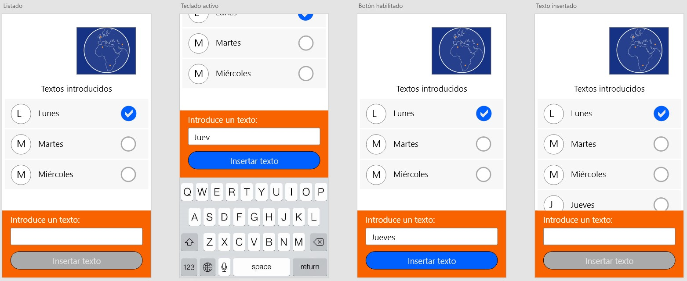

# Prueba técnica Xamarin iOS #
El objetivo de la prueba es resolver un problema donde se va a valorar los siguientes conocimientos del candidato:

1. Conocimientos de las clases nativas relacionadas con el desarrollo de las vistas de la aplicación en la plataforma Xamarin iOS.
2. Conocimientos de las clases relacionadas con la implementación de listas y celdas.
3. Conocimientos de integración de librerías nativas en un desarrollo Xamarin.
4. Conocimientos del patrón MVVM.
5. Conocimientos del framework [MvvmCross](https://www.mvvmcross.com/).

La prueba estará disponible en un repositorio de Github. El candidato, una vez finalice la prueba, deberá hacer un **Pull Request** de la misma para su valoración.

## Definición del problema ##

Se quiere una aplicación en Xamarin iOS que va a consistir en una única pantalla. La funcionalidad principal es la de mostrar una lista de palabras en pantalla, además de permitir al usuario que inserte nuevos elementos en ella.  
Adicionalmente, los elementos de la lista se podrán seleccionar con el dedo mostrando un checkbox sobre el último seleccionado. Es decir, a lo sumo, sólo puede haber una palabra seleccionada. Si pulso sobre una entrada ya seleccionada, esta se deselecciona.

Esta prueba no requiere que los elementos de la lista se puedan borrar o modificar. Tampoco es necesario implementar funcionalidad para almacenar los datos introducidos en repositorios, ficheros ni bases de datos.

Se debe tener en cuenta que la aparición del teclado en pantalla no oculte el cuadro de texto. Así el usuario podrá ver el texto que está introduciendo.

Estas pantallas son unicamente a modo de guía. No es necesario que el candidato siga el diseño teniendo en cuenta el tamaño exacto de los elementos, fuentes ni códigos de color mostrados.

## Otras especificaciones ##

Se desea que la imagen de la aprte superior sea una animación en formato _lottie_. Se adjunta en el repositorio el fichero en formato json. El ancho de la imagen debe ser del 40% de la pantalla. Y debe colocarse centrado en la parte derecha de la pantalla. Es decir, si la pantalla la dividimos en dos columnas, pondremos la imagen centrada en la columna de la derecha.

A continuación vendrá la lista de nombres que ocupará todo el espacio disponible en pantalla hasta el panel de entrada de datos. Si se insertan más elementos de lso que caben visualmente en la lista, debe proporcionar funcionalidad de scroll. Pero siempre teniendo en cuenta que la animación y el botón con el cuadro de texto deben permancer fijos.  
Las celdas tendrán un formato de 3 columnas:
- La parte izquierda tendrá un círculo con la primera letra del texto.
- La parte derecha tendrá el control con el checkbox.
- La parte central ocupará todo el resto de la celda y contrandrá el texto introducido por el usuario.

Como parte del proceso queremos comprobar la capacidad del candidato para integrar un control nativo iOS dentro de Xamarin. Para ello tendrá que usar la librería nativa que se incluye en el repositorio y que corresponde con un control de tipo Checkbox. Esta librería se basa en el control nativo [BEMCheckBox](https://github.com/Boris-Em/BEMCheckBox). Se adjunta en el repositorio la librería ya compilada y en formato nativo.  
Si el candidato no puede hacer esta integración, puede utilizar el control nativo de Xamarin `UISwitch`.

La parte inferior de la pantalla estará fija y consistirá en un cuadro de texto y un botón. Al pulsar el botón se añadirá el contenido del cuadro de texto a la lista siempre y cuando no esté vacío. Después de insertar el texto, el contenido del cuadro se vaciará.  
Se valorará que si el cuadro de texto está vacío, el botón no esté habilitado y no permita la inserción.

Es importante que se utilice el patrón MVVM en el desarrollo de esta prueba para valorar los conocimientos del mismo. Como ayuda, se propone utilizar el framework MvvmCross. Si el candidato no tiene conocimientos de este framework podrá montar su propia infraestructura de clases desde cero.

No se proporciona ningún proyecto ni solución inicial. El candidato tendrá que crear la solución desde cero. Se entiende que al menos tendrá un proyecto para la parte común con los _models_ y los _view models_ y otro proyecto para la plataforma iOS con las vistas.

Existen dos tipos de aproximaciones para el desarrollo de pantallas: La primera de forma visual mediante ficheros .storyboard y .xib; y la segunda mediante código en la clase que hereda de `UIViewController` en los ficheros .cs  
La aproximación que se desea es la segunda. Así el candidato tendrá que crearse a través de código C# los controles y el layout de la pantalla. 

Se desa valorar la capacidad de crear vistas parciales que puedan ser reutilizables en otras partes de la aplicación. Para ello, se pide que la animación esté dentro de una clase que herede de `UIView` (por ejemplo, `UIWorldLottieView`) para poder ser reutilizada.  No es necesario que este control exponga propiedades y funcionalidades específicas hacia el exterior. El objetivo es que se pueda usar como si de un control `UIView` se tratara.

## Otros puntos de consideración ##

Aunque siempre es valorable la resolución de todos los puntos, en caso de que el candidato desconozca alguno de ellos, este puede optar por una solución alternativa. Por ejemplo, si no puede resolver la integración de una librería nativa dentro de Xamarin, podrá usar otra soportada por Xamarin o implementarse su propia solución.

Se tendrá muy en cuenta el estilo de codificación y buenas prácticas. Que sea fácil de leer y entender por otro desarrollador. A modo de guía se facilitan algunas recomendaciones dadas por Microsoft:
- [Convenciones de nombrado](https://docs.microsoft.com/es-es/dotnet/csharp/programming-guide/inside-a-program/identifier-names)
- [Convenciones de codificación](https://docs.microsoft.com/es-es/dotnet/csharp/programming-guide/inside-a-program/coding-conventions)

No será necesario el uso de test unitarios en esta prueba dado que el objetivo es sobre todo ver los conocimientos de Xamarin iOS del candidato.